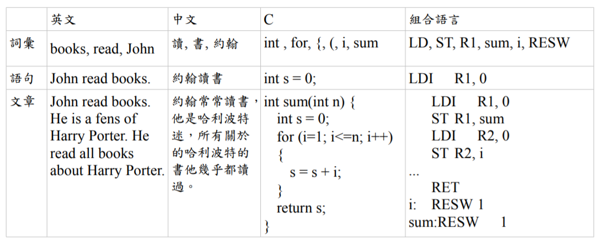

# 第十二周筆記

## 自然語言

* 自然地隨文化演化的語言（狹義）

* 所有人類使用的語言都會被視為「自然」語言（廣義）

## 人造語言

人造語言是許多因特定目的、用途，為了某特定使用族群，而人為創造出來的語言，包括文法、單字等等。人造語言不像自然語言一樣會隨人類的語言文化而發展，但是，它們在被創造之後，卻可能因而產生特定的影響力，隨著人類文化如真實語言一樣地演進。

### 人造語言可按創造意圖分為：

* 輔助語言
* 藝術語言
* 工程語言

## 語言的層次

不論是以上哪些語言，幾乎都具有「詞彙、語句、文章」等三個層次，以下是這幾個層次的範例。

如果將各個層次分開處理，那麼語言的處理就可以分為：

* 詞彙掃描 : 詞彙層次
* 語法剖析 : 語句層次
* 語意解析 : 文章層次
* 語言合成 : 回應階段，將《詞彙》組合成《語句》、再將《語句》組合成《文章》呈現出來！

總而言之，一個翻譯系統就需要具備《整合以上四項處理的能力》！

## 參考資料

* <https://zh.wikipedia.org/wiki/%E8%87%AA%E7%84%B6%E8%AF%AD%E8%A8%80>

* <https://zh.wikipedia.org/wiki/%E4%BA%BA%E5%B7%A5%E8%AA%9E%E8%A8%80>

* <https://programmermedia.org/root/%E9%99%B3%E9%8D%BE%E8%AA%A0/%E6%9B%B8%E7%B1%8D/aijs/07-%E8%AA%9E%E8%A8%80%E8%99%95%E7%90%86/B-%E8%AA%9E%E6%B3%95%E7%90%86%E8%AB%96.md>
